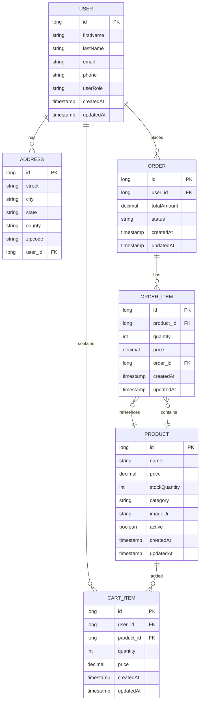

# Database Entity Relationship Diagram (ERD)

## ER Diagram (Mermaid)



## Table Schema

### 1. T_USER
**Primary Key**: `id`  
**Inheritance**: BaseEntity (createdAt, updatedAt)

| Column | Type | Constraints | Description |
|--------|------|-----------|-------------|
| `id` | BIGINT | PK, AUTO_INCREMENT | Unique user identifier |
| `first_name` | VARCHAR(255) | NOT NULL | User's first name |
| `last_name` | VARCHAR(255) | NOT NULL | User's last name |
| `email` | VARCHAR(255) | NOT NULL, UNIQUE | User's email address |
| `phone` | VARCHAR(20) | | Phone number |
| `user_role` | VARCHAR(50) | DEFAULT 'CUSTOMER' | ADMIN or CUSTOMER |
| `created_at` | TIMESTAMP | NOT NULL | Record creation time |
| `updated_at` | TIMESTAMP | NOT NULL | Record last update time |

**Relationships**:
- `1:1` with T_ADDRESS (one user has one address)
- `1:M` with T_CART_ITEM (one user can have many cart items)
- `1:M` with T_ORDER (one user can place many orders)

---

### 2. T_ADDRESS
**Primary Key**: `id`  
**Foreign Key**: `user_id` → T_USER(id)  
**Cascade**: ON DELETE CASCADE

| Column | Type | Constraints | Description |
|--------|------|-----------|-------------|
| `id` | BIGINT | PK | Same as user_id (shared PK) |
| `street` | VARCHAR(255) | | Street address |
| `city` | VARCHAR(100) | | City name |
| `state` | VARCHAR(50) | | State/Province |
| `county` | VARCHAR(100) | | County |
| `zipcode` | VARCHAR(20) | | Postal code |
| `user_id` | BIGINT | FK, NOT NULL | Reference to T_USER |

**Relationships**:
- `1:1` with T_USER (reverse mapping)
- Orphan removal enabled: address deleted when user is deleted

---

### 3. T_PRODUCT
**Primary Key**: `id`  
**Inheritance**: BaseEntity (createdAt, updatedAt)

| Column | Type | Constraints | Description |
|--------|------|-----------|-------------|
| `id` | BIGINT | PK, AUTO_INCREMENT | Unique product identifier |
| `name` | VARCHAR(255) | NOT NULL | Product name |
| `price` | DECIMAL(19,2) | NOT NULL | Product price |
| `stock_quantity` | INT | DEFAULT 0 | Available stock |
| `category` | VARCHAR(100) | | Product category |
| `image_url` | VARCHAR(500) | | Product image URL |
| `active` | BOOLEAN | DEFAULT TRUE | Product active status |
| `created_at` | TIMESTAMP | NOT NULL | Record creation time |
| `updated_at` | TIMESTAMP | NOT NULL | Record last update time |

**Relationships**:
- `1:M` with T_CART_ITEM (product can be in multiple carts)
- `1:M` with T_ORDER_ITEM (product can be in multiple orders)

**Indexes** (recommended):
- `idx_product_active`: ON active (for product listing)
- `idx_product_name`: ON name (for search)
- `idx_product_category`: ON category (for filtering)

---

### 4. T_CART_ITEM
**Primary Key**: `id`  
**Foreign Keys**: 
- `user_id` → T_USER(id) - ON DELETE CASCADE
- `product_id` → T_PRODUCT(id) - ON DELETE CASCADE  
**Inheritance**: BaseEntity (createdAt, updatedAt)

| Column | Type | Constraints | Description |
|--------|------|-----------|-------------|
| `id` | BIGINT | PK, AUTO_INCREMENT | Unique cart item identifier |
| `user_id` | BIGINT | FK, NOT NULL | Reference to T_USER |
| `product_id` | BIGINT | FK, NOT NULL | Reference to T_PRODUCT |
| `quantity` | INT | NOT NULL | Item quantity (> 0) |
| `price` | DECIMAL(19,2) | NOT NULL | Total price (product.price × quantity) |
| `created_at` | TIMESTAMP | NOT NULL | Record creation time |
| `updated_at` | TIMESTAMP | NOT NULL | Record last update time |

**Unique Constraint** (recommended):
- `UNIQUE(user_id, product_id)` - Only one cart entry per user per product

**Relationships**:
- `M:1` with T_USER (many items per user)
- `M:1` with T_PRODUCT (many carts can have same product)

**Behavior**:
- When product added to cart:
  - If (user_id, product_id) exists: UPDATE quantity and price
  - If new: INSERT new cart item
- When user places order: all cart items deleted
- When product deleted: all related cart items deleted

---

### 5. T_ORDER
**Primary Key**: `id`  
**Foreign Key**: `user_id` → T_USER(id)  
**Inheritance**: BaseEntity (createdAt, updatedAt)

| Column | Type | Constraints | Description |
|--------|------|-----------|-------------|
| `id` | BIGINT | PK, AUTO_INCREMENT | Unique order identifier |
| `user_id` | BIGINT | FK, NOT NULL | Reference to T_USER |
| `total_amount` | DECIMAL(19,2) | NOT NULL | Order total (sum of order items) |
| `status` | VARCHAR(50) | DEFAULT 'PENDING' | Order status (ENUM) |
| `created_at` | TIMESTAMP | NOT NULL | Record creation time |
| `updated_at` | TIMESTAMP | NOT NULL | Record last update time |

**Status Values** (ENUM):
- `PENDING` - Initial state
- `CONFIRMED` - Payment confirmed
- `SHIPPED` - Order in transit
- `DELIVERED` - Order received
- `CANCELLED` - Order cancelled

**Relationships**:
- `M:1` with T_USER (many orders per user)
- `1:M` with T_ORDER_ITEM (one order has many items)

**Indexes** (recommended):
- `idx_order_user_id`: ON user_id (for user order history)
- `idx_order_status`: ON status (for order status queries)
- `idx_order_created_at`: ON created_at (for date filtering)

---

### 6. T_ORDER_ITEM
**Primary Key**: `id`  
**Foreign Keys**:
- `product_id` → T_PRODUCT(id)
- `order_id` → T_ORDER(id) - ON DELETE CASCADE  
**Inheritance**: BaseEntity (createdAt, updatedAt)

| Column | Type | Constraints | Description |
|--------|------|-----------|-------------|
| `id` | BIGINT | PK, AUTO_INCREMENT | Unique order item identifier |
| `product_id` | BIGINT | FK, NOT NULL | Reference to T_PRODUCT |
| `quantity` | INT | NOT NULL | Quantity ordered |
| `price` | DECIMAL(19,2) | NOT NULL | Price per unit at order time |
| `order_id` | BIGINT | FK, NOT NULL | Reference to T_ORDER |
| `created_at` | TIMESTAMP | NOT NULL | Record creation time |
| `updated_at` | TIMESTAMP | NOT NULL | Record last update time |

**Relationships**:
- `M:1` with T_PRODUCT (snapshot of product data)
- `M:1` with T_ORDER (many items per order)

**Behavior**:
- Stores product snapshot (name, price) at time of order
- When order deleted: all order items deleted (orphan removal)
- Product can be referenced by multiple orders (historical data preserved)

---

## Relationship Types Summary

| From | To | Type | Cardinality | Join Column | Cascade | Note |
|------|----|----|-----------|-----------|---------|------|
| USER | ADDRESS | OneToOne | 1:1 | user_id | ALL, orphanRemoval | PrimaryKeyJoinColumn |
| USER | CART_ITEM | OneToMany | 1:M | user_id | - | mappedBy: user |
| USER | ORDER | OneToMany | 1:M | user_id | - | mappedBy: user |
| PRODUCT | CART_ITEM | OneToMany | 1:M | product_id | - | mappedBy: product |
| PRODUCT | ORDER_ITEM | OneToMany | 1:M | product_id | - | mappedBy: product |
| CART_ITEM | USER | ManyToOne | M:1 | user_id | - | LAZY fetch |
| CART_ITEM | PRODUCT | ManyToOne | M:1 | product_id | - | LAZY fetch |
| ORDER | USER | ManyToOne | M:1 | user_id | - | LAZY fetch |
| ORDER | ORDER_ITEM | OneToMany | 1:M | order_id | ALL, orphanRemoval | mappedBy: order |
| ORDER_ITEM | PRODUCT | ManyToOne | M:1 | product_id | - | LAZY fetch |
| ORDER_ITEM | ORDER | ManyToOne | M:1 | order_id | - | LAZY fetch |

---

## Data Flow Scenarios

### Scenario 1: User Adds Product to Cart
```
1. UserEntity retrieved from T_USER by ID
2. ProductEntity retrieved from T_PRODUCT by ID
3. Query T_CART_ITEM for (user_id, product_id)
4. If exists:
   - UPDATE quantity: quantity += requested
   - UPDATE price: product.price × new_quantity
5. Else:
   - INSERT new CartItemEntity
   - price = product.price × quantity
```

### Scenario 2: User Places Order
```
1. UserEntity retrieved by ID
2. Query T_CART_ITEM for all items WHERE user_id = ?
3. Validate cart not empty
4. For each CartItemEntity:
   - Create OrderItemEntity
   - Copy: product_id, quantity, price
   - Set order reference
5. Calculate totalAmount = SUM(price from all order items)
6. INSERT OrderEntity with status = PENDING
7. DELETE all CartItemEntity records for user
8. Return created Order
```

### Scenario 3: Order Status Update
```
1. OrderEntity retrieved by ID
2. UPDATE T_ORDER SET status = ? WHERE id = ?
3. Timestamp auto-updated by @PreUpdate
4. Return updated Order
```

### Scenario 4: Product Delete
```
1. DELETE FROM T_PRODUCT WHERE id = ?
2. ON DELETE CASCADE triggers:
   - DELETE FROM T_CART_ITEM WHERE product_id = ?
   - DELETE FROM T_ORDER_ITEM WHERE product_id = ?
3. Order records remain (historical data)
4. Orders reference deleted product (FK allows NULL in some cases)
```

---

## Migration Path to Postgres + MongoDB

### Step 1: PostgreSQL (Relational Data)
Move these tables to PostgreSQL:
- T_USER → postgres.users
- T_ADDRESS → postgres.addresses
- T_ORDER → postgres.orders
- T_ORDER_ITEM → postgres.order_items
- T_CART_ITEM → postgres.cart_items

**Configuration**:
```properties
spring.datasource.url=jdbc:postgresql://localhost:5432/ecom
spring.datasource.username=ecom_user
spring.datasource.password=secure_password
spring.jpa.database-platform=org.hibernate.dialect.PostgreSQL10Dialect
```

### Step 2: MongoDB (Product Catalog - Optional)
Move to MongoDB for flexibility:
- T_PRODUCT → mongo.products collection

**Benefits**:
- Flexible schema for product attributes
- Better performance for search
- Easy to add new product fields

**Configuration**:
```properties
spring.data.mongodb.uri=mongodb://localhost:27017/ecom
```

### Step 3: Elasticsearch (Search Optimization)
Index products for fast search:
- Sync product updates to ES
- Use Elasticsearch for search queries

---

## Current Schema

```sql
-- User
CREATE TABLE t_user (
    id BIGINT GENERATED BY DEFAULT AS IDENTITY PRIMARY KEY,
    first_name VARCHAR(255) NOT NULL,
    last_name VARCHAR(255) NOT NULL,
    email VARCHAR(255) NOT NULL UNIQUE,
    phone VARCHAR(20),
    user_role VARCHAR(50) DEFAULT 'CUSTOMER',
    created_at TIMESTAMP NOT NULL,
    updated_at TIMESTAMP NOT NULL
);

-- Address
CREATE TABLE t_address (
    id BIGINT PRIMARY KEY,
    street VARCHAR(255),
    city VARCHAR(100),
    state VARCHAR(50),
    county VARCHAR(100),
    zipcode VARCHAR(20),
    user_id BIGINT NOT NULL UNIQUE,
    FOREIGN KEY (user_id) REFERENCES t_user(id) ON DELETE CASCADE
);

-- Product
CREATE TABLE t_product (
    id BIGINT AUTO_INCREMENT PRIMARY KEY,
    name VARCHAR(255) NOT NULL,
    price DECIMAL(19,2) NOT NULL,
    stock_quantity INT DEFAULT 0,
    category VARCHAR(100),
    image_url VARCHAR(500),
    active BOOLEAN DEFAULT TRUE,
    created_at TIMESTAMP NOT NULL,
    updated_at TIMESTAMP NOT NULL
);

-- Cart Item
CREATE TABLE t_cart_item (
    id BIGINT AUTO_INCREMENT PRIMARY KEY,
    user_id BIGINT NOT NULL,
    product_id BIGINT NOT NULL,
    quantity INT NOT NULL,
    price DECIMAL(19,2) NOT NULL,
    created_at TIMESTAMP NOT NULL,
    updated_at TIMESTAMP NOT NULL,
    UNIQUE (user_id, product_id),
    FOREIGN KEY (user_id) REFERENCES t_user(id) ON DELETE CASCADE,
    FOREIGN KEY (product_id) REFERENCES t_product(id) ON DELETE CASCADE
);

-- Order
CREATE TABLE t_order (
    id BIGINT AUTO_INCREMENT PRIMARY KEY,
    user_id BIGINT NOT NULL,
    total_amount DECIMAL(19,2) NOT NULL,
    status VARCHAR(50) DEFAULT 'PENDING',
    created_at TIMESTAMP NOT NULL,
    updated_at TIMESTAMP NOT NULL,
    FOREIGN KEY (user_id) REFERENCES t_user(id)
);

-- Order Item
CREATE TABLE t_order_item (
    id BIGINT AUTO_INCREMENT PRIMARY KEY,
    product_id BIGINT NOT NULL,
    quantity INT NOT NULL,
    price DECIMAL(19,2) NOT NULL,
    order_id BIGINT NOT NULL,
    created_at TIMESTAMP NOT NULL,
    updated_at TIMESTAMP NOT NULL,
    FOREIGN KEY (product_id) REFERENCES t_product(id),
    FOREIGN KEY (order_id) REFERENCES t_order(id) ON DELETE CASCADE
);
```

